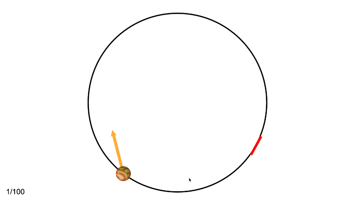

# Generalizing physical prediction by composing forces and objects

Our ability to make reliable physical predictions even in novel settings is a hallmark of human intelligence. Here we inves- tigate how people infer multiple physical variables simultaneously and compose them to generalize to a novel scenario.

## Overview

In this work, we sought to explore how people learn physical world models such that they can compositionally generalize to novel scenarios and make reliable predictions. To this end, we developed a novel paradigm where participants must infer multiple latent variables of the physical dynamics during training and compose them to generalize in the test phase. Specifically, we ask participants to play a physics-based video game. In this game, participants use a paddle to catch three balls of different masses in two environments where different latent forces (downward gravity and a wind force blowing to the right) are at play. People were trained on 5 out of these 6 ball-environment combinations and then asked to generalize to the held-out combination. In order to succeed at this task, participants must infer the latent structure (e.g. the existence of different latent forces in different environments) as well as physical parameters (e.g. mass of different balls) of the underlying dynamics and compose these to generalize in the novel ball-environment combination. We found that people can learn both latent variables, and critically compose this knowledge to generalize to the novel combinations in the test phase.

The final write-up for the CogSci 2022 conference can be found [here](https://haoliangwang.github.io/assets/papers/Generalizing_physical_prediction_by_composing_forces_and_objects.pdf).

## Organization

### Experiment
`/experiments`: Code for running the experiment
- `/experiments/index.html`: run this script to start the experiment locally.

### Stimuli
`/stimuli`: Contains stimuli for the experiment
- `/stimuli/dict.json` stimuli used in the experiment.
- `/stimuli/generate_metadata.ipynb`: code used to generate the stimuli for the experiment.
